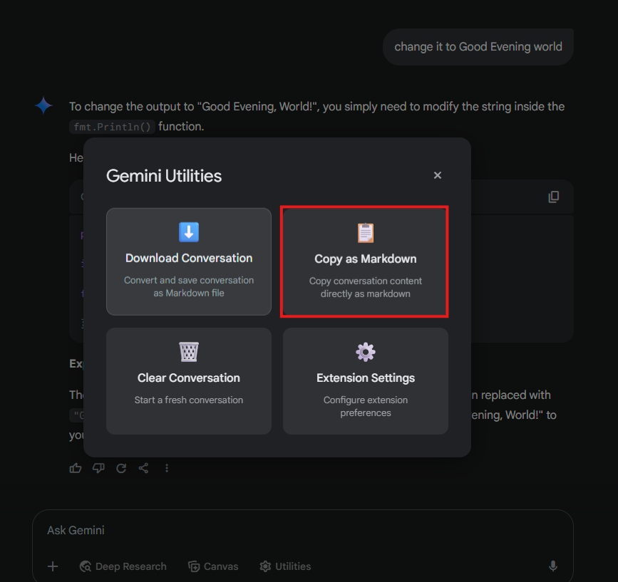

# Gemini to Markdown (GeminiNoteTaker) Chrome Extension

## Overview
This Chrome extension enhances your experience on the Gemini platform (`https://gemini.google.com/`) by simplifying the process of saving conversations and content as `.md` (Markdown) files. It automates the task of extracting, converting (HTML to Markdown), and saving chat content, which is especially useful for developers, writers, and anyone who frequently works with Gemini and requires Markdown output.

## Problem Solved
Previously, saving content from Gemini as a Markdown file involved a manual, multi-step process:
1.  Manually selecting and copying content from Gemini.
2.  Opening a text editor.
3.  Pasting the copied content.
4.  Manually cleaning up and formatting the content for Markdown (e.g., code blocks, lists).
5.  Saving the file with a `.md` extension.

This repetitive workflow was time-consuming and prone to formatting errors. This extension was created to streamline this process into a few clicks, directly within the Gemini interface.

## Key Features

*   **Direct HTML-to-Markdown Conversion**: Utilizes the integrated **Turndown.js library** to accurately convert Gemini's HTML chat content directly into well-formatted Markdown. This includes proper handling of code blocks, lists, headings, and other common HTML elements.
*   **Integrated "Utilities" Menu**: A "Utilities" button is dynamically added to the Gemini UI, providing access to:
    *   **⬇️ Download Conversation**: Extracts the current chat, converts it to Markdown, and prompts for a filename to save. Includes smart filename suggestions (using conversation title or a detailed timestamp).
    *   **📋 Copy as Markdown**: Converts the current conversation to Markdown and copies it directly to your clipboard, ready to paste into any application.
    *   **🗑️ Clear Conversation**: Quickly starts a fresh chat session in Gemini (with a confirmation prompt).
    *   **⚙️ Extension Settings**: Access a settings panel to customize filename formats and toggle auto-download behavior.
*   **Automatic Copy Button Integration (Configurable)**: Optionally, the extension can detect clicks on Gemini's native "Copy" button to automatically trigger a download popup with the copied content, already converted to Markdown.
*   **Smart Filename Generation**: Suggests filenames based on the conversation's H2 title (if available) or a timestamp format (e.g., `GeminiConversation_DDMMYYYY_HHMMAMPM.md`).
*   **UI/UX**: 
    *   **Dark Theme Integration**: The extension's UI (popups, overlays) is styled to match Gemini's dark theme for a consistent look and feel.
    *   **Toast Notifications**: Provides non-intrusive feedback for actions like "Copied to clipboard" or "File saved."
*   **Robust and Modern**: Built using Manifest V3 standards. Includes retry mechanisms for UI element injection and graceful error handling.

## Installation

1.  **Download the Extension Files**:
    *   Download or clone this repository to your local machine.
    *   Ensure all files are present in the `MD_File_Creator` (or the main extension) directory.
2.  **Open Chrome Extensions Page**:
    *   Open Google Chrome.
    *   Navigate to `chrome://extensions/` in the address bar.
3.  **Enable Developer Mode**:
    *   In the top-right corner of the Extensions page, find the "Developer mode" toggle and switch it **ON**.
4.  **Load the Extension**:
    *   Click the "Load unpacked" button (usually on the top-left).
    *   In the file dialog, navigate to and select the root folder of the extension (e.g., `MD_File_Creator`).
5.  **Verify Installation**:
    *   The "Gemini to Markdown (GeminiNoteTaker)" extension should now appear in your list of installed extensions.
    *   Ensure it is enabled.

## How to Use

Once installed, the extension primarily works on the `https://gemini.google.com/` website.

1.  **Navigate to Gemini**: Open a conversation on the Gemini platform.
2.  **Accessing Utilities**: Look for the **"Utilities"** button, which should appear in the Gemini interface (typically near the "Canvas" or other toolbar buttons).
    *   Clicking the "Utilities" button will open an overlay menu.
3.  **Using the Utilities Menu**:
    *   **Download Conversation**: Select this option to extract the current chat. The content will be converted to Markdown, and a popup will appear allowing you to confirm or change the filename before saving the `.md` file.
    *   **Copy as Markdown**: Select this to convert the current chat to Markdown and copy it to your clipboard. A toast notification will confirm the action.
    *   **Clear Conversation**: Click this to initiate a new chat in Gemini. A confirmation will be requested.
    *   **Extension Settings**: Opens a dialog to configure preferences like default filename format and auto-download behavior (e.g., triggering download on native copy button click).

## Troubleshooting

*   **Extension Not Loading / Errors on Load**:
    *   Ensure all files from the repository/ZIP are in the selected folder.
    *   Verify `manifest.json` is valid (no syntax errors).
    *   Make sure "Developer mode" is enabled on `chrome://extensions/`.
    *   Try removing and re-adding the extension.
*   **"Utilities" Button Missing**: 
    *   Refresh the Gemini page. The button is injected dynamically and might take a moment.
    *   Wait 5-10 seconds for the script's retry mechanism.
    *   Check the browser console (F12 -> Console) for any error messages related to the extension.
    *   Ensure you are on an active `https://gemini.google.com/` page with a conversation.
*   **Downloads Not Working / Markdown Formatting Issues**: 
    *   Check Chrome's download settings and ensure the site is not blocked from downloading files.
    *   Verify your computer's download folder is accessible and has space.
    *   If Markdown formatting is incorrect (especially for code), ensure the extension is up to date and report the issue if it persists.
*   **Permissions**: The extension requires `clipboardRead` (to read content when you click Gemini's copy button, if that feature is enabled in settings) and `downloads` (to save files). Ensure these are granted.

## Technical Details

*   **Manifest Version**: 3
*   **Core Technologies**: JavaScript, HTML, CSS
*   **Key Libraries/APIs**: Chrome Extension APIs (Storage, Downloads, Scripting), DOM Manipulation, **Turndown.js** for HTML-to-Markdown conversion.
*   **Required Permissions**: `clipboardRead`, `downloads`
*   **Target Website**: `https://gemini.google.com/*`
*   **Browser Compatibility**: Designed for Google Chrome and other Chromium-based browsers that support Manifest V3 extensions.

## Screenshots

Below are examples of the extension's Utilities overlay in action:

## Acknowledgments

*   This extension was developed with the assistance of AI tools, including GitHub Copilot, for code generation, suggestions, and problem-solving.
*   The **Turndown.js** library is crucial for the HTML-to-Markdown conversion functionality.

---

**Happy Markdown Creating! 🚀**

